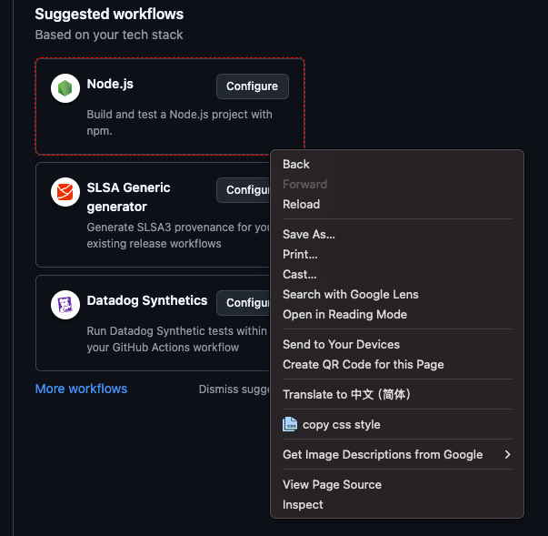

[中文🇨🇳](./README_zh.md "")

## CopyCssStyle: A Convenient Chrome Extension for Developers

**CopyCssStyle** is a handy Chrome extension designed to help developers quickly copy common styles of DOM elements, speeding up the development and design process.

## Key Features:

- **Quick Style Copying**: With a simple click, you can quickly copy the common styles of the selected DOM element, including color, shadow, border, and more.
- **Simple and Easy to Use**: The interface is clean and clear, and the operations are easy to understand. No complex settings are required to quickly copy styles.

## How to Use:

- **Install the Extension**: Drag the plugin folder into the Chrome browser's extension page.  
  Alternatively, you can install it directly from the Chrome Web Store [CopyCssStyle](https://chromewebstore.google.com/detail/copycssstyle/nneolbanmfgdfglpgebdokdflebpdhdi).
- **Select the Target Element on the Webpage**: Click the extension icon, move the mouse to the target DOM element, and a red dashed outline will appear around the currently selected DOM element.
- **Copy the Style**: Right-click and select "copy css style" to copy the style properties to the clipboard.
- **Paste the Style**: Paste the copied style properties into the target code to apply the selected styles.
- **Close the Extension**: Click the extension icon again to disable the feature.

## Notes:

1. The extension only supports copying common style properties of DOM elements. Some special styles may not be copied.
2. There may be limitations or compatibility issues on certain websites.
3. If clicking the extension icon doesn't respond when hovering over DOM elements, try refreshing the page and clicking the extension icon again.

## Feedback and Support:
For any questions or suggestions, feel free to report issues on [GitHub](https://github.com/XFSeven7/copyCssStyle/issues).
