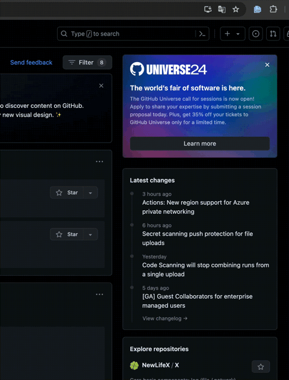
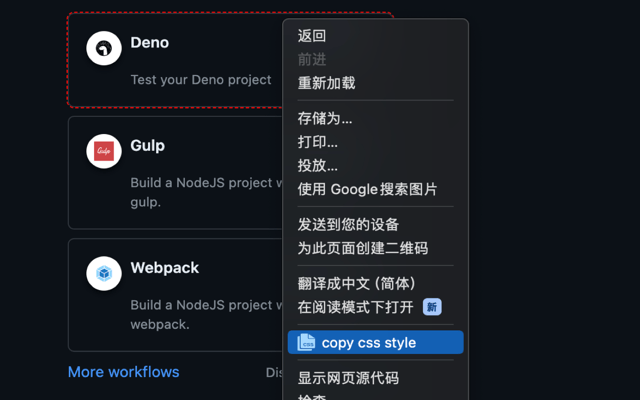

copyCssStyle是一款方便快捷的 Chrome 插件，旨在帮助开发者快速复制 DOM 元素的常见样式，以加快开发和设计流程。

## 主要功能：

- 快速复制样式： 通过简单的点击操作，可以快速复制所选 DOM 元素的常见样式，包括颜色、阴影、边框等。
- 简洁易用： 界面简洁清晰，操作简单易懂，无需繁琐的设置即可快速复制样式。

## 如何使用：

- 安装插件：把plugin文件夹拖到chrome浏览器的拓展程序中。
- 在网页中选择目标元素：点击插件图标，鼠标移动到目标 DOM 元素，红色虚线会包裹当前选中的DOM元素。
- 复制样式：点击鼠标右键，点击copy css style即可将样式属性复制到剪贴板。
- 粘贴样式：将复制的样式属性粘贴到目标代码中，以应用所选样式。
- 关闭插件：再次点击插件图片即可关闭该功能

## 注意事项：

1. 插件仅支持复制 DOM 元素的常见样式属性，部分特殊样式可能无法复制。
2. 在某些网站中可能存在限制或兼容性问题。
3. 如果点击插件图标后，鼠标出现在DOM元素上但是没有反应，可以刷新页面，重新点击插件图片尝试。

## 反馈和支持：
如有任何问题或建议， [issues](https://github.com/XFSeven7/copyCssStyle/issues) 等你
